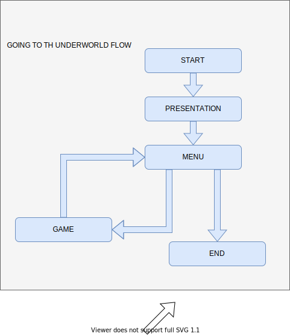
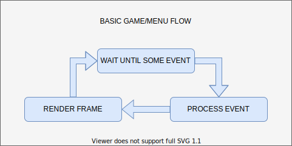
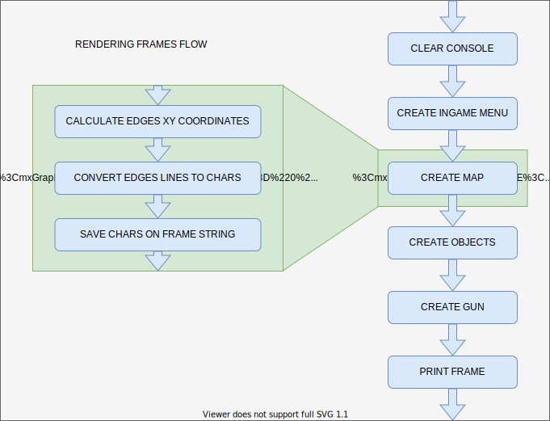

# GoInG To ThE UnDeRwOrLd
This is a shooter game made with Netwide Assembler (NASM) for 64-bit Linux, the purpose of this project is to hang out some time and learn in depth assembler.

## Assembling, linking and running
1. If you don't have installed NASM, run `$ sudo apt install nasm`.
1. Clone with `$ git clone https://github.com/LimaBD/going-to-the-underworld.git`.
1. Run `$ make`.
1. Run `$ ./going-to-the-underworld`.

## How it works
The entire game use ░ ▒ ▓ █ ▀ ▄ ▌ ▐ ■ ▪ characters to render the graphics.

